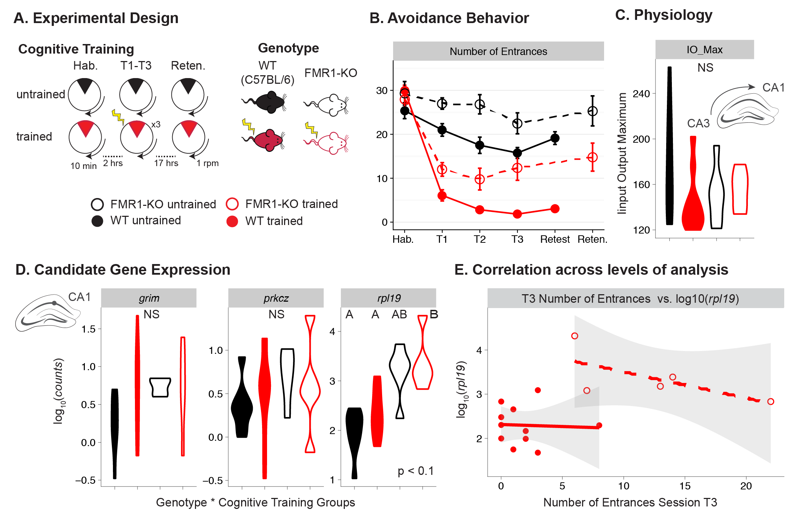

# Abstract

In this experiment, I ask if avoidance behaviors are regulated by molecular changes that alter the synaptic activity in a hippocampal circuit. My null hypothesis is that a conditioned place avoidance response is not due to long-term molecular changes at pre- and post-synaptic levels of a neuronal circuits. One alternative hypothesis is that changes in gene expression of candidate proteins whose activity underline functional changes in synapses subservient of memory that have long been studies will underlie changes in behavior. A type II statistical error would be that something other than knowledge acquisition and memory alter cell and molecular biology. I describe our first collaborative and integrative studying analyzing behavior, electrophysiology, and candidate gene expression in mice in a pop-up laboratory at the Marine Biological Laboratories. In this study, we fail to reject the null hypothesis that synaptic plasticity at the CA3-CA1 synapse and molecular activity in CA3 and CA1 do not regulate avoidance learning. However, I concluded that this outcome was the result of technical limitations (setting up a new lab takes time) and mishaps (using unfamiliar protocols) and not of biological significance. 

## Data Management

## data
- 01_fmr1-WT-DataSet.xlsx: the mutli-tab spreadsheet given to be by Andre
- 01_FMR1behavephys.csv: the fmr1 tab of data
- 01_WTbehavephys.csv: the wt tab of data
- 02_dilutions_CA1CA3.csv: the qcpr dilution series
- 02_qpcrdata.csv: the qpcr sample data sheet
- 02_qPCRdata.xlsx: the excell version of the qpcr data sheet
- 03_behavephysqpcr_WTonly_old.csv: an old analyses that I still have
- 

## bin	
- [01_behavphysqpcr.Rmd](https://github.com/raynamharris/FMR1CA1qPCR/blob/master/bin/01_behavphysqpcr.Rmd): the analysis file
- [01_behavphysqpcr.md](https://github.com/raynamharris/FMR1CA1qPCR/blob/master/bin/01_behavphysqpcr.md): the output 

## figures

