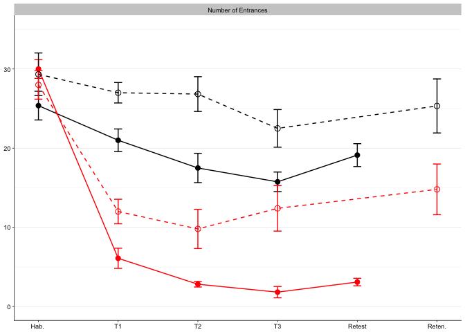

    ## 
    ## Attaching package: 'dplyr'

    ## The following objects are masked from 'package:stats':
    ## 
    ##     filter, lag

    ## The following objects are masked from 'package:base':
    ## 
    ##     intersect, setdiff, setequal, union

    ## -------------------------------------------------------------------------

    ## You have loaded plyr after dplyr - this is likely to cause problems.
    ## If you need functions from both plyr and dplyr, please load plyr first, then dplyr:
    ## library(plyr); library(dplyr)

    ## -------------------------------------------------------------------------

    ## 
    ## Attaching package: 'plyr'

    ## The following objects are masked from 'package:dplyr':
    ## 
    ##     arrange, count, desc, failwith, id, mutate, rename, summarise,
    ##     summarize

    ## 
    ## Attaching package: 'cowplot'

    ## The following object is masked from 'package:ggplot2':
    ## 
    ##     ggsave

    ## Loading required package: MCMCglmm

    ## Loading required package: Matrix

    ## Loading required package: coda

    ## Loading required package: ape

    ## 
    ## Attaching package: 'reshape'

    ## The following object is masked from 'package:Matrix':
    ## 
    ##     expand

    ## The following objects are masked from 'package:reshape2':
    ## 
    ##     colsplit, melt, recast

    ## The following objects are masked from 'package:plyr':
    ## 
    ##     rename, round_any

    ## The following object is masked from 'package:dplyr':
    ## 
    ##     rename

    ## Loading required package: xts

    ## Loading required package: zoo

    ## 
    ## Attaching package: 'zoo'

    ## The following objects are masked from 'package:base':
    ## 
    ##     as.Date, as.Date.numeric

    ## 
    ## Attaching package: 'xts'

    ## The following objects are masked from 'package:dplyr':
    ## 
    ##     first, last

    ## 
    ## Attaching package: 'PerformanceAnalytics'

    ## The following object is masked from 'package:graphics':
    ## 
    ##     legend

    ## Loading required package: lattice

    ## Loading required package: survival

    ## Loading required package: Formula

    ## 
    ## Attaching package: 'Hmisc'

    ## The following object is masked from 'package:ape':
    ## 
    ##     zoom

    ## The following object is masked from 'package:ggdendro':
    ## 
    ##     label

    ## The following objects are masked from 'package:plyr':
    ## 
    ##     is.discrete, summarize

    ## The following objects are masked from 'package:dplyr':
    ## 
    ##     combine, src, summarize

    ## The following objects are masked from 'package:base':
    ## 
    ##     format.pval, round.POSIXt, trunc.POSIXt, units

Behavior
--------

    ##  [1] "filename"                 "p.miss"                  
    ##  [3] "total"                    "total.1"                 
    ##  [5] "X..of"                    "time.to"                 
    ##  [7] "path.to"                  "speed"                   
    ##  [9] "entr."                    "X..of.1"                 
    ## [11] "time.to.1"                "path.to.1"               
    ## [13] "speed.1"                  "sd.of"                   
    ## [15] "line."                    "max."                    
    ## [17] "max..1"                   "time.to.2"               
    ## [19] "path.to.2"                "speed.2"                 
    ## [21] "Time"                     "pTime"                   
    ## [23] "pTime.1"                  "pTime.2"                 
    ## [25] "pTime.3"                  "Rayleig"                 
    ## [27] "Rayleig.1"                "Polar"                   
    ## [29] "Polar.1"                  "Polar.2"                 
    ## [31] "Polar.3"                  "Min"                     
    ## [33] "Min.1"                    "Polar.4"                 
    ## [35] "Polar.5"                  "Max"                     
    ## [37] "Max.1"                    "Annular"                 
    ## [39] "Annular.1"                "Annular.2"               
    ## [41] "Annular.3"                "Annular.4"               
    ## [43] "Annular.5"                "Annular.6"               
    ## [45] "Annular.7"                "mouse.id"                
    ## [47] "genotype"                 "group"                   
    ## [49] "LocomotorActivity"        "RECENT.LocomotorActivity"
    ## [51] "Punishment"               "Punishment.1"            
    ## [53] "Learning"                 "Memory"                  
    ## [55] "Memory.1"                 "SynapseFunction"         
    ## [57] "SynapsePlasticity"        "PopSpike.max........mV." 
    ## [59] "PospSpike.Probability"

    ##  [1] "filename"                 "p.miss"                  
    ##  [3] "total"                    "total.1"                 
    ##  [5] "X..of"                    "time.to"                 
    ##  [7] "path.to"                  "speed"                   
    ##  [9] "entr."                    "X..of.1"                 
    ## [11] "time.to.1"                "path.to.1"               
    ## [13] "speed.1"                  "sd.of"                   
    ## [15] "line."                    "max."                    
    ## [17] "max..1"                   "time.to.2"               
    ## [19] "path.to.2"                "speed.2"                 
    ## [21] "Time"                     "pTime"                   
    ## [23] "pTime.1"                  "pTime.2"                 
    ## [25] "pTime.3"                  "Rayleig"                 
    ## [27] "Rayleig.1"                "Polar"                   
    ## [29] "Polar.1"                  "Polar.2"                 
    ## [31] "Polar.3"                  "Min"                     
    ## [33] "Min.1"                    "Polar.4"                 
    ## [35] "Polar.5"                  "Max"                     
    ## [37] "Max.1"                    "Annular"                 
    ## [39] "Annular.1"                "Annular.2"               
    ## [41] "Annular.3"                "Annular.4"               
    ## [43] "Annular.5"                "Annular.6"               
    ## [45] "Annular.7"                "mouse.id"                
    ## [47] "genotype"                 "group"                   
    ## [49] "LocomotorActivity"        "RECENT.LocomotorActivity"
    ## [51] "Punishment"               "Punishment.1"            
    ## [53] "Learning"                 "Memory"                  
    ## [55] "Memory.1"                 "SynapseFunction"         
    ## [57] "SynapsePlasticity"        "PopSpike.max........mV." 
    ## [59] "PospSpike.Probability"

    ## [1] "               _NA"                  
    ## [2] "               _NA"                  
    ## [3] "               _NA"                  
    ## [4] "                 bl1D1Hab_Room_Train"
    ## [5] "              bl1D1Train1_Room_Train"
    ## [6] "              bl1D1Train2_Room_Train"

    ##   [1] "               _NA" "               _NA" "               _NA"
    ##   [4] "BL 1"               "BL 1"               "BL 1"              
    ##   [7] "BL 1"               "BL 1"               "NA_NA"             
    ##  [10] "BL 2"               "BL 2"               "BL 2"              
    ##  [13] "BL 2"               "BL 2"               "NA_NA"             
    ##  [16] "BL 3"               "BL 3"               "BL 3"              
    ##  [19] "BL 3"               "BL 3"               "NA_NA"             
    ##  [22] "BL 4"               "BL 4"               "BL 4"              
    ##  [25] "BL 4"               "BL 4"               "NA_NA"             
    ##  [28] "BL 5"               "BL 5"               "BL 5"              
    ##  [31] "BL 5"               "BL 5"               "NA_NA"             
    ##  [34] "BL 6"               "BL 6"               "BL 6"              
    ##  [37] "BL 6"               "BL 6"               "NA_NA"             
    ##  [40] "BL 7"               "BL 7"               "BL 7"              
    ##  [43] "BL 7"               "BL 7"               "NA_NA"             
    ##  [46] "BL 8"               "BL 8"               "BL 8"              
    ##  [49] "BL 8"               "BL 8"               "NA_NA"             
    ##  [52] "BL 9"               "BL 9"               "BL 9"              
    ##  [55] "BL 9"               "BL 9"               "NA_NA"             
    ##  [58] "BL 10"              "BL 10"              "BL 10"             
    ##  [61] "BL 10"              "BL 10"              "NA_NA"             
    ##  [64] "BL 11"              "BL 11"              "BL 11"             
    ##  [67] "BL 11"              "BL 11"              "NA_NA"             
    ##  [70] "BL 12"              "BL 12"              "BL 12"             
    ##  [73] "BL 12"              "BL 12"              "NA_NA"             
    ##  [76] "BL 13"              "BL 13"              "BL 13"             
    ##  [79] "BL 13"              "BL 13"              "NA_NA"             
    ##  [82] "BL 14"              "BL 14"              "BL 14"             
    ##  [85] "BL 14"              "BL 14"              "NA_NA"             
    ##  [88] "BL 15"              "BL 15"              "BL 15"             
    ##  [91] "BL 15"              "BL 15"              "NA_NA"             
    ##  [94] "BL 16"              "BL 16"              "BL 16"             
    ##  [97] "BL 16"              "BL 16"              "NA_NA"             
    ## [100] "BL 17"              "BL 17"              "BL 17"             
    ## [103] "BL 17"              "BL 17"              "NA_NA"             
    ## [106] "BL 18"              "BL 18"              "BL 18"             
    ## [109] "BL 18"              "BL 18"              "NA_NA"             
    ## [112] "BL 19"              "BL 19"              "BL 19"             
    ## [115] "BL 19"              "BL 19"

    ##  [1] "               " "               " "               "
    ##  [4] "FMR1 AB"         "FMR1 AB"         "FMR1 AB"        
    ##  [7] "FMR1 AB"         "FMR1 AB"         NA               
    ## [10] "FMR1 A"          "FMR1 A"          "FMR1 A"         
    ## [13] "FMR1 A"          "FMR1 A"          NA               
    ## [16] "FMR1 B"          "FMR1 B"          "FMR1 B"         
    ## [19] "FMR1 B"          "FMR1 B"          NA               
    ## [22] "FMR1 C"          "FMR1 C"          "FMR1 C"         
    ## [25] "FMR1 C"          "FMR1 C"          NA               
    ## [28] "FMR1 E"          "FMR1 E"          "FMR1 E"         
    ## [31] "FMR1 E"          "FMR1 E"          NA               
    ## [34] "FMR1 F"          "FMR1 F"          "FMR1 F"         
    ## [37] "FMR1 F"          "FMR1 F"          NA               
    ## [40] "FMR1 G"          "FMR1 G"          "FMR1 G"         
    ## [43] "FMR1 G"          "FMR1 G"          NA               
    ## [46] "FMR1 H"          "FMR1 H"          "FMR1 H"         
    ## [49] "FMR1 H"          "FMR1 H"          NA               
    ## [52] "FMR1 I"          "FMR1 I"          "FMR1 I"         
    ## [55] "FMR1 I"          "FMR1 I"          NA               
    ## [58] "FMR1 J"          "FMR1 J"          "FMR1 J"         
    ## [61] "FMR1 J"          "FMR1 J"          NA               
    ## [64] "FMR1 K"          "FMR1 K"          "FMR1 K"         
    ## [67] "FMR1 K"          "FMR1 K"          NA

    ##  [1] "filename"               "p.miss"                
    ##  [3] "TotalTime"              "TotalPath"             
    ##  [5] "Entrances"              "TimeToFirstEntrance"   
    ##  [7] "PathToFirstEntrance"    "SpeedToFirstEntrance"  
    ##  [9] "EntrancePerDistance"    "TotalShocks"           
    ## [11] "TimeToFirstShock"       "PathToFirstShock"      
    ## [13] "Speed"                  "SDofSpeed"             
    ## [15] "LineArity"              "MaxAvoidTime"          
    ## [17] "MaxAvoidPath"           "TimeToSecondEntrance"  
    ## [19] "PathToSecondEntrance"   "SpeedToSecondEntranc"  
    ## [21] "TimeTARG"               "pTimeTARG"             
    ## [23] "pTimeCCW"               "pTimeOPP"              
    ## [25] "pTimeCW"                "RayleigLength"         
    ## [27] "RayleigAngle"           "PolarAveVal"           
    ## [29] "PolarSdVal"             "PolarMinVal"           
    ## [31] "PolarMinBin"            "MinLoBin"              
    ## [33] "MinHiBin"               "PolarMaxVal"           
    ## [35] "PolarMaxBin"            "MaxLoBin"              
    ## [37] "MaxHiBin"               "AnnularMinVal"         
    ## [39] "AnnularMinBin"          "AnnularMaxVal"         
    ## [41] "AnnularMaxBin"          "AnnularAvg"            
    ## [43] "AnnularSD"              "AnnularSkewnes"        
    ## [45] "AnnularKurtosis"        "ind_bad"               
    ## [47] "genotype_bad"           "APA"                   
    ## [49] "TotalLocomotorActivity" "LastLocomotorActivity" 
    ## [51] "TotalPunishment"        "Punishment.1"          
    ## [53] "LastPunishment"         "LastTotalEntrances"    
    ## [55] "T1Retention"            "T2Retention"           
    ## [57] "IO_Max"                 "LTP_Baseline"          
    ## [59] "LTP_Baseline_SD"        "ind"

    ## 'data.frame':    150 obs. of  61 variables:
    ##  $ filename              : chr  "                 bl1D1Hab_Room_Train" "              bl1D1Train1_Room_Train" "              bl1D1Train2_Room_Train" "              bl1D1Train3_Room_Train" ...
    ##  $ p.miss                : num  0 0 0 0 0.0525 0 0.00072 0 0.0315 0.00883 ...
    ##  $ TotalTime             : chr  "600" "600" "600" "600" ...
    ##  $ TotalPath             : chr  "28.21" "17.64" "16.86" "15.53" ...
    ##  $ Entrances             : chr  "32" "8" "3" "2" ...
    ##  $ TimeToFirstEntrance   : chr  "1.5" "27.77" "32.03" "22.33" ...
    ##  $ PathToFirstEntrance   : chr  "0.11" "1.19" "0.57" "0.41" ...
    ##  $ SpeedToFirstEntrance  : chr  "13.11" "9.02" "1.88" "1.56" ...
    ##  $ EntrancePerDistance   : chr  "1.13" "0.45" "0.18" "0.13" ...
    ##  $ TotalShocks           : chr  "81" "8" "3" "2" ...
    ##  $ TimeToFirstShock      : chr  "1.5" "27.77" "32.03" "22.33" ...
    ##  $ PathToFirstShock      : chr  "0.11" "1.19" "0.57" "0.41" ...
    ##  $ Speed                 : chr  "4.7" "2.94" "2.81" "2.59" ...
    ##  $ SDofSpeed             : chr  "3.67" "2.9" "2.75" "2.62" ...
    ##  $ LineArity             : chr  "0.624" "0.6925" "0.6699" "0.6563" ...
    ##  $ MaxAvoidTime          : chr  "52" "180" "541" "560" ...
    ##  $ MaxAvoidPath          : chr  "2.15" "4.73" "14.98" "0.41" ...
    ##  $ TimeToSecondEntrance  : chr  "21.97" "67.4" "53.53" "39.53" ...
    ##  $ PathToSecondEntrance  : chr  "1.22" "2.15" "1.22" "0.93" ...
    ##  $ SpeedToSecondEntranc  : chr  "8.11" "1.91" "2.04" "1.69" ...
    ##  $ TimeTARG              : chr  "152.865" "6.633" "2.431" "1.6" ...
    ##  $ pTimeTARG             : chr  "0.3681" "0.0165" "0.0066" "0.0041" ...
    ##  $ pTimeCCW              : chr  "0.2256" "0.2127" "0.1592" "0.1551" ...
    ##  $ pTimeOPP              : chr  "0.1051" "0.5037" "0.4673" "0.5646" ...
    ##  $ pTimeCW               : chr  "0.3012" "0.2671" "0.367" "0.2762" ...
    ##  $ RayleigLength         : chr  "0.25" "0.5" "0.56" "0.65" ...
    ##  $ RayleigAngle          : chr  "339.62" "195.41" "204.06" "198.65" ...
    ##  $ PolarAveVal           : chr  "152.56" "248.34" "256.34" "274.63" ...
    ##  $ PolarSdVal            : chr  "101.95" "72.05" "68.24" "54.9" ...
    ##  $ PolarMinVal           : chr  "0.0087" "0.0006" "0" "0" ...
    ##  $ PolarMinBin           : chr  "190" "0" "0" "340" ...
    ##  $ MinLoBin              : chr  "0" "240" "250" "240" ...
    ##  $ MinHiBin              : chr  "250" "180" "190" "190" ...
    ##  $ PolarMaxVal           : chr  "0.0546" "0.0802" "0.0879" "0.0849" ...
    ##  $ PolarMaxBin           : chr  "330" "200" "230" "220" ...
    ##  $ MaxLoBin              : chr  "250" "160" "180" "170" ...
    ##  $ MaxHiBin              : chr  "30" "250" "270" "250" ...
    ##  $ AnnularMinVal         : chr  "0.0121" "0.006" "0.0013" "0.0015" ...
    ##  $ AnnularMinBin         : chr  "19.4" "3.5" "3.5" "3.5" ...
    ##  $ AnnularMaxVal         : chr  "0.4487" "0.4759" "0.5119" "0.4852" ...
    ##  $ AnnularMaxBin         : chr  "16.6" "16.6" "18" "18" ...
    ##  $ AnnularAvg            : chr  "15.7" "16.74" "17.17" "17" ...
    ##  $ AnnularSD             : chr  "14.57" "11.28" "8.06" "9.18" ...
    ##  $ AnnularSkewnes        : chr  "2.1" "4.26" "2.88" "2.84" ...
    ##  $ AnnularKurtosis       : chr  "9.29" "31.51" "21.98" "17.08" ...
    ##  $ ind_bad               : chr  NA NA NA NA ...
    ##  $ genotype_bad          : chr  NA NA NA NA ...
    ##  $ APA                   : chr  NA NA NA NA ...
    ##  $ TotalLocomotorActivity: chr  NA NA NA NA ...
    ##  $ LastLocomotorActivity : chr  NA NA NA NA ...
    ##  $ TotalPunishment       : chr  NA NA NA NA ...
    ##  $ Punishment.1          : chr  NA NA NA NA ...
    ##  $ LastPunishment        : chr  NA NA NA NA ...
    ##  $ LastTotalEntrances    : chr  NA NA NA NA ...
    ##  $ T1Retention           : chr  NA NA NA NA ...
    ##  $ T2Retention           : chr  NA NA NA NA ...
    ##  $ IO_Max                : chr  NA NA NA NA ...
    ##  $ LTP_Baseline          : num  NA NA NA NA 0 NA NA NA NA 9.3 ...
    ##  $ LTP_Baseline_SD       : int  NA NA NA NA 0 NA NA NA NA 1 ...
    ##  $ ind                   : chr  "BL 1" "BL 1" "BL 1" "BL 1" ...
    ##  $ genotype              : Factor w/ 2 levels "WT","FMR1-KO": 1 1 1 1 1 1 1 1 1 1 ...

    ## 'data.frame':    150 obs. of  61 variables:
    ##  $ filename              : chr  "                 bl1D1Hab_Room_Train" "              bl1D1Train1_Room_Train" "              bl1D1Train2_Room_Train" "              bl1D1Train3_Room_Train" ...
    ##  $ p.miss                : num  0 0 0 0 0.0525 0 0.00072 0 0.0315 0.00883 ...
    ##  $ TotalTime             : num  600 600 600 600 600 600 600 600 600 600 ...
    ##  $ TotalPath             : num  28.2 17.6 16.9 15.5 20.2 ...
    ##  $ Entrances             : num  32 8 3 2 2 35 4 4 1 4 ...
    ##  $ TimeToFirstEntrance   : num  1.5 27.8 32 22.3 131.6 ...
    ##  $ PathToFirstEntrance   : num  0.11 1.19 0.57 0.41 5.71 0.45 0 0.76 0.44 0.35 ...
    ##  $ SpeedToFirstEntrance  : num  13.11 9.02 1.88 1.56 8.35 ...
    ##  $ EntrancePerDistance   : num  1.13 0.45 0.18 0.13 0.1 1.18 0.2 0.22 0.06 0.17 ...
    ##  $ TotalShocks           : num  81 8 3 2 2 59 4 4 1 4 ...
    ##  $ TimeToFirstShock      : num  1.5 27.8 32 22.3 131.6 ...
    ##  $ PathToFirstShock      : num  0.11 1.19 0.57 0.41 5.71 0.45 0 0.76 0.44 0.35 ...
    ##  $ Speed                 : num  4.7 2.94 2.81 2.59 3.36 4.93 3.3 3 2.9 3.94 ...
    ##  $ SDofSpeed             : num  3.67 2.9 2.75 2.62 3.17 3.73 2.84 2.74 2.32 3.44 ...
    ##  $ LineArity             : num  0.624 0.693 0.67 0.656 0.448 ...
    ##  $ MaxAvoidTime          : num  52 180 541 560 295 61 417 348 568 334 ...
    ##  $ MaxAvoidPath          : num  2.15 4.73 14.98 0.41 7.49 ...
    ##  $ TimeToSecondEntrance  : num  22 67.4 53.5 39.5 304.8 ...
    ##  $ PathToSecondEntrance  : num  1.22 2.15 1.22 0.93 12.14 ...
    ##  $ SpeedToSecondEntranc  : num  8.11 1.91 2.04 1.69 10.42 ...
    ##  $ TimeTARG              : num  152.87 6.63 2.43 1.6 8.73 ...
    ##  $ pTimeTARG             : num  0.3681 0.0165 0.0066 0.0041 0.0235 ...
    ##  $ pTimeCCW              : num  0.2256 0.2127 0.1592 0.1551 0.0322 ...
    ##  $ pTimeOPP              : num  0.105 0.504 0.467 0.565 0.55 ...
    ##  $ pTimeCW               : num  0.301 0.267 0.367 0.276 0.394 ...
    ##  $ RayleigLength         : num  0.25 0.5 0.56 0.65 0.69 0.09 0.49 0.65 0.62 0.62 ...
    ##  $ RayleigAngle          : num  340 195 204 199 219 ...
    ##  $ PolarAveVal           : num  153 248 256 275 256 ...
    ##  $ PolarSdVal            : num  102 72 68.2 54.9 71.4 ...
    ##  $ PolarMinVal           : num  0.0087 0.0006 0 0 0.0005 0.0142 0.0002 0 0 0.0002 ...
    ##  $ PolarMinBin           : num  190 0 0 340 40 70 0 0 0 0 ...
    ##  $ MinLoBin              : num  0 240 250 240 240 350 170 230 220 140 ...
    ##  $ MinHiBin              : num  250 180 190 190 190 210 90 190 160 80 ...
    ##  $ PolarMaxVal           : num  0.0546 0.0802 0.0879 0.0849 0.111 0.0468 0.0714 0.0936 0.0752 0.0772 ...
    ##  $ PolarMaxBin           : num  330 200 230 220 230 220 110 230 190 140 ...
    ##  $ MaxLoBin              : num  250 160 180 170 170 130 70 180 150 70 ...
    ##  $ MaxHiBin              : num  30 250 270 250 250 310 180 250 240 160 ...
    ##  $ AnnularMinVal         : num  0.0121 0.006 0.0013 0.0015 0.0046 0.0015 0.0003 0.0018 0.001 0.0007 ...
    ##  $ AnnularMinBin         : num  19.4 3.5 3.5 3.5 3.5 19.4 19.4 3.5 8.5 19.4 ...
    ##  $ AnnularMaxVal         : num  0.449 0.476 0.512 0.485 0.449 ...
    ##  $ AnnularMaxBin         : num  16.6 16.6 18 18 16.6 15 15 16.6 16.6 16.6 ...
    ##  $ AnnularAvg            : num  15.7 16.7 17.2 17 16.6 ...
    ##  $ AnnularSD             : num  14.57 11.28 8.06 9.18 11.74 ...
    ##  $ AnnularSkewnes        : num  2.1 4.26 2.88 2.84 2.6 1.67 1.61 1.57 1.49 2.5 ...
    ##  $ AnnularKurtosis       : num  9.29 31.51 21.98 17.08 15.71 ...
    ##  $ ind_bad               : chr  NA NA NA NA ...
    ##  $ genotype_bad          : chr  NA NA NA NA ...
    ##  $ APA                   : Factor w/ 2 levels "trained","untrained": NA NA NA NA 1 NA NA NA NA 1 ...
    ##  $ TotalLocomotorActivity: num  NA NA NA NA 98.4 ...
    ##  $ LastLocomotorActivity : num  NA NA NA NA 20.2 ...
    ##  $ TotalPunishment       : num  NA NA NA NA 15 NA NA NA NA 13 ...
    ##  $ Punishment.1          : num  NA NA NA NA 2 NA NA NA NA 4 ...
    ##  $ LastPunishment        : num  NA NA NA NA 15 NA NA NA NA 13 ...
    ##  $ LastTotalEntrances    : num  NA NA NA NA 132 ...
    ##  $ T1Retention           : num  NA NA NA NA 305 ...
    ##  $ T2Retention           : num  NA NA NA NA 12 NA NA NA NA 9.8 ...
    ##  $ IO_Max                : chr  NA NA NA NA ...
    ##  $ LTP_Baseline          : num  NA NA NA NA 0 NA NA NA NA 9.3 ...
    ##  $ LTP_Baseline_SD       : num  NA NA NA NA 0 NA NA NA NA 1 ...
    ##  $ ind                   : Factor w/ 30 levels "BL 1","BL 10",..: 1 1 1 1 1 12 12 12 12 12 ...
    ##  $ genotype              : Factor w/ 2 levels "WT","FMR1-KO": 1 1 1 1 1 1 1 1 1 1 ...

    ##   [1] "pretraining" "training1"   "training2"   "training3"   "retest"     
    ##   [6] "pretraining" "training1"   "training2"   "training3"   "retest"     
    ##  [11] "pretraining" "training1"   "training2"   "training3"   "retest"     
    ##  [16] "pretraining" "training1"   "training2"   "training3"   "retest"     
    ##  [21] "pretraining" "training1"   "training2"   "training3"   "retest"     
    ##  [26] "pretraining" "training1"   "training2"   "training3"   "retest"     
    ##  [31] "pretraining" "training1"   "training2"   "training3"   "retest"     
    ##  [36] "pretraining" "training1"   "training2"   "training3"   "retest"     
    ##  [41] "pretraining" "training1"   "training2"   "training3"   "retest"     
    ##  [46] "pretraining" "training1"   "training2"   "training3"   "retest"     
    ##  [51] "pretraining" "training1"   "training2"   "training3"   "retest"     
    ##  [56] "pretraining" "training1"   "training2"   "training3"   "retest"     
    ##  [61] "pretraining" "training1"   "training2"   "training3"   "retest"     
    ##  [66] "pretraining" "training1"   "training2"   "training3"   "retest"     
    ##  [71] "pretraining" "training1"   "training2"   "training3"   "retest"     
    ##  [76] "pretraining" "training1"   "training2"   "training3"   "retest"     
    ##  [81] "pretraining" "training1"   "training2"   "training3"   "retest"     
    ##  [86] "pretraining" "training1"   "training2"   "training3"   "retest"     
    ##  [91] "pretraining" "training1"   "training2"   "training3"   "retest"     
    ##  [96] "pretraining" "training1"   "training2"   "training3"   "retention"  
    ## [101] "pretraining" "training1"   "training2"   "training3"   "retention"  
    ## [106] "pretraining" "training1"   "training2"   "training3"   "retention"  
    ## [111] "pretraining" "training1"   "training2"   "training3"   "retention"  
    ## [116] "pretraining" "training1"   "training2"   "training3"   "retention"  
    ## [121] "pretraining" "training1"   "training2"   "training3"   "retention"  
    ## [126] "pretraining" "training1"   "training2"   "training3"   "retention"  
    ## [131] "pretraining" "training1"   "training2"   "training3"   "retention"  
    ## [136] "pretraining" "training1"   "training2"   "training3"   "retention"  
    ## [141] "pretraining" "training1"   "training2"   "training3"   "retention"  
    ## [146] "pretraining" "training1"   "training2"   "training3"   "retention"

    ##  [1] "ind"                    "genotype"              
    ##  [3] "APA"                    "session"               
    ##  [5] "TotalLocomotorActivity" "LastLocomotorActivity" 
    ##  [7] "TotalPunishment"        "Punishment.1"          
    ##  [9] "LastPunishment"         "LastTotalEntrances"    
    ## [11] "T1Retention"            "T2Retention"           
    ## [13] "IO_Max"                 "LTP_Baseline"          
    ## [15] "LTP_Baseline_SD"        "filename"

    ## 'data.frame':    30 obs. of  16 variables:
    ##  $ ind                   : Factor w/ 30 levels "BL 1","BL 10",..: 1 12 13 14 15 16 17 18 19 2 ...
    ##  $ genotype              : Factor w/ 2 levels "WT","FMR1-KO": 1 1 1 1 1 1 1 1 1 1 ...
    ##  $ APA                   : Factor w/ 2 levels "trained","untrained": 1 1 1 2 1 2 1 2 1 2 ...
    ##  $ session               : Factor w/ 6 levels "pretraining",..: 6 6 6 6 6 6 6 6 6 6 ...
    ##  $ TotalLocomotorActivity: num  98.4 108.4 97.9 109.3 97.4 ...
    ##  $ LastLocomotorActivity : num  20.2 23.6 15.4 24 16.3 ...
    ##  $ TotalPunishment       : num  15 13 6 0 21 0 10 0 9 0 ...
    ##  $ Punishment.1          : num  2 4 1 0 3 0 5 0 2 0 ...
    ##  $ LastPunishment        : num  15 13 6 85 17 56 10 83 9 82 ...
    ##  $ LastTotalEntrances    : num  131.57 6.83 162.9 4.73 58.57 ...
    ##  $ T1Retention           : num  304.8 94.9 600 18.5 331.2 ...
    ##  $ T2Retention           : num  12 9.8 4 2.4 2.6 2.1 5.8 6.5 13 3.8 ...
    ##  $ IO_Max                : chr  "130.0%" "127.0%" "136.0%" "212.0%" ...
    ##  $ LTP_Baseline          : num  0 9.3 3.7 NA 0 NA 5.9 0 26 0 ...
    ##  $ LTP_Baseline_SD       : num  0 1 1 NA 0 NA 1 0 1 0 ...
    ##  $ filename              : chr  "              bl1D2Retest_Room_Train" "              bl2D2Retest_Room_Train" "              bl3D2Retest_Room_Train" "              bl4D2Retest_Room_Control" ...

    ##  [1] trained   trained   trained   untrained trained   untrained trained  
    ##  [8] untrained trained   untrained trained   untrained trained   untrained
    ## [15] trained   untrained trained   untrained trained   untrained untrained
    ## [22] trained   trained   untrained trained   untrained trained   untrained
    ## [29] trained   untrained
    ## Levels: untrained trained

    ##  [1] WT_trained        WT_trained        WT_trained       
    ##  [4] WT_untrained      WT_trained        WT_untrained     
    ##  [7] WT_trained        WT_untrained      WT_trained       
    ## [10] WT_untrained      WT_trained        WT_untrained     
    ## [13] WT_trained        WT_untrained      WT_trained       
    ## [16] WT_untrained      WT_trained        WT_untrained     
    ## [19] WT_trained        FMR1-KO_untrained FMR1-KO_untrained
    ## [22] FMR1-KO_trained   FMR1-KO_trained   FMR1-KO_untrained
    ## [25] FMR1-KO_trained   FMR1-KO_untrained FMR1-KO_trained  
    ## [28] FMR1-KO_untrained FMR1-KO_trained   FMR1-KO_untrained
    ## Levels: WT_untrained WT_trained FMR1-KO_untrained FMR1-KO_trained

    ##    ind genotype       APA session TotalLocomotorActivity
    ## 1 BL 1       WT   trained  retest                  98.40
    ## 2 BL 2       WT   trained  retest                 108.41
    ## 3 BL 3       WT   trained  retest                  97.90
    ## 4 BL 4       WT untrained  retest                 109.33
    ## 5 BL 5       WT   trained  retest                  97.36
    ## 6 BL 6       WT untrained  retest                 113.41
    ##   LastLocomotorActivity TotalPunishment Punishment.1 LastPunishment
    ## 1                 20.16              15            2             15
    ## 2                 23.62              13            4             13
    ## 3                 15.43               6            1              6
    ## 4                 24.00               0            0             85
    ## 5                 16.30              21            3             17
    ## 6                 17.01               0            0             56
    ##   LastTotalEntrances T1Retention T2Retention IO_Max LTP_Baseline
    ## 1             131.57      304.80        12.0    130          0.0
    ## 2               6.83       94.93         9.8    127          9.3
    ## 3             162.90      599.97         4.0    136          3.7
    ## 4               4.73       18.53         2.4    212           NA
    ## 5              58.57      331.20         2.6    125          0.0
    ## 6              10.83       36.07         2.1    203           NA
    ##   LTP_Baseline_SD                               filename      genoAPA
    ## 1               0                 bl1D2Retest_Room_Train   WT_trained
    ## 2               1                 bl2D2Retest_Room_Train   WT_trained
    ## 3               1                 bl3D2Retest_Room_Train   WT_trained
    ## 4              NA               bl4D2Retest_Room_Control WT_untrained
    ## 5               0                 bl5D2Retest_Room_Train   WT_trained
    ## 6              NA               bl6D2Retest_Room_Control WT_untrained

    ## 'data.frame':    330 obs. of  8 variables:
    ##  $ ind     : Factor w/ 30 levels "BL 1","BL 10",..: 1 12 13 14 15 16 17 18 19 2 ...
    ##  $ genotype: Factor w/ 2 levels "WT","FMR1-KO": 1 1 1 1 1 1 1 1 1 1 ...
    ##  $ APA     : Factor w/ 2 levels "untrained","trained": 2 2 2 1 2 1 2 1 2 1 ...
    ##  $ session : Factor w/ 6 levels "pretraining",..: 6 6 6 6 6 6 6 6 6 6 ...
    ##  $ filename: chr  "              bl1D2Retest_Room_Train" "              bl2D2Retest_Room_Train" "              bl3D2Retest_Room_Train" "              bl4D2Retest_Room_Control" ...
    ##  $ genoAPA : Factor w/ 4 levels "WT_untrained",..: 2 2 2 1 2 1 2 1 2 1 ...
    ##  $ variable: Factor w/ 11 levels "TotalLocomotorActivity",..: 1 1 1 1 1 1 1 1 1 1 ...
    ##  $ value   : num  98.4 108.4 97.9 109.3 97.4 ...

    ## [1] "WT_untrained"      "WT_trained"        "FMR1-KO_untrained"
    ## [4] "FMR1-KO_trained"

    ## 'data.frame':    150 obs. of  62 variables:
    ##  $ filename              : chr  "                 bl1D1Hab_Room_Train" "              bl1D1Train1_Room_Train" "              bl1D1Train2_Room_Train" "              bl1D1Train3_Room_Train" ...
    ##  $ p.miss                : num  0 0 0 0 0.0525 0 0.00072 0 0.0315 0.00883 ...
    ##  $ TotalTime             : num  600 600 600 600 600 600 600 600 600 600 ...
    ##  $ TotalPath             : num  28.2 17.6 16.9 15.5 20.2 ...
    ##  $ Entrances             : num  32 8 3 2 2 35 4 4 1 4 ...
    ##  $ TimeToFirstEntrance   : num  1.5 27.8 32 22.3 131.6 ...
    ##  $ PathToFirstEntrance   : num  0.11 1.19 0.57 0.41 5.71 0.45 0 0.76 0.44 0.35 ...
    ##  $ SpeedToFirstEntrance  : num  13.11 9.02 1.88 1.56 8.35 ...
    ##  $ EntrancePerDistance   : num  1.13 0.45 0.18 0.13 0.1 1.18 0.2 0.22 0.06 0.17 ...
    ##  $ TotalShocks           : num  81 8 3 2 2 59 4 4 1 4 ...
    ##  $ TimeToFirstShock      : num  1.5 27.8 32 22.3 131.6 ...
    ##  $ PathToFirstShock      : num  0.11 1.19 0.57 0.41 5.71 0.45 0 0.76 0.44 0.35 ...
    ##  $ Speed                 : num  4.7 2.94 2.81 2.59 3.36 4.93 3.3 3 2.9 3.94 ...
    ##  $ SDofSpeed             : num  3.67 2.9 2.75 2.62 3.17 3.73 2.84 2.74 2.32 3.44 ...
    ##  $ LineArity             : num  0.624 0.693 0.67 0.656 0.448 ...
    ##  $ MaxAvoidTime          : num  52 180 541 560 295 61 417 348 568 334 ...
    ##  $ MaxAvoidPath          : num  2.15 4.73 14.98 0.41 7.49 ...
    ##  $ TimeToSecondEntrance  : num  22 67.4 53.5 39.5 304.8 ...
    ##  $ PathToSecondEntrance  : num  1.22 2.15 1.22 0.93 12.14 ...
    ##  $ SpeedToSecondEntranc  : num  8.11 1.91 2.04 1.69 10.42 ...
    ##  $ TimeTARG              : num  152.87 6.63 2.43 1.6 8.73 ...
    ##  $ pTimeTARG             : num  0.3681 0.0165 0.0066 0.0041 0.0235 ...
    ##  $ pTimeCCW              : num  0.2256 0.2127 0.1592 0.1551 0.0322 ...
    ##  $ pTimeOPP              : num  0.105 0.504 0.467 0.565 0.55 ...
    ##  $ pTimeCW               : num  0.301 0.267 0.367 0.276 0.394 ...
    ##  $ RayleigLength         : num  0.25 0.5 0.56 0.65 0.69 0.09 0.49 0.65 0.62 0.62 ...
    ##  $ RayleigAngle          : num  340 195 204 199 219 ...
    ##  $ PolarAveVal           : num  153 248 256 275 256 ...
    ##  $ PolarSdVal            : num  102 72 68.2 54.9 71.4 ...
    ##  $ PolarMinVal           : num  0.0087 0.0006 0 0 0.0005 0.0142 0.0002 0 0 0.0002 ...
    ##  $ PolarMinBin           : num  190 0 0 340 40 70 0 0 0 0 ...
    ##  $ MinLoBin              : num  0 240 250 240 240 350 170 230 220 140 ...
    ##  $ MinHiBin              : num  250 180 190 190 190 210 90 190 160 80 ...
    ##  $ PolarMaxVal           : num  0.0546 0.0802 0.0879 0.0849 0.111 0.0468 0.0714 0.0936 0.0752 0.0772 ...
    ##  $ PolarMaxBin           : num  330 200 230 220 230 220 110 230 190 140 ...
    ##  $ MaxLoBin              : num  250 160 180 170 170 130 70 180 150 70 ...
    ##  $ MaxHiBin              : num  30 250 270 250 250 310 180 250 240 160 ...
    ##  $ AnnularMinVal         : num  0.0121 0.006 0.0013 0.0015 0.0046 0.0015 0.0003 0.0018 0.001 0.0007 ...
    ##  $ AnnularMinBin         : num  19.4 3.5 3.5 3.5 3.5 19.4 19.4 3.5 8.5 19.4 ...
    ##  $ AnnularMaxVal         : num  0.449 0.476 0.512 0.485 0.449 ...
    ##  $ AnnularMaxBin         : num  16.6 16.6 18 18 16.6 15 15 16.6 16.6 16.6 ...
    ##  $ AnnularAvg            : num  15.7 16.7 17.2 17 16.6 ...
    ##  $ AnnularSD             : num  14.57 11.28 8.06 9.18 11.74 ...
    ##  $ AnnularSkewnes        : num  2.1 4.26 2.88 2.84 2.6 1.67 1.61 1.57 1.49 2.5 ...
    ##  $ AnnularKurtosis       : num  9.29 31.51 21.98 17.08 15.71 ...
    ##  $ ind_bad               : chr  NA NA NA NA ...
    ##  $ genotype_bad          : chr  NA NA NA NA ...
    ##  $ APA                   : Factor w/ 2 levels "trained","untrained": NA NA NA NA 1 NA NA NA NA 1 ...
    ##  $ TotalLocomotorActivity: num  NA NA NA NA 98.4 ...
    ##  $ LastLocomotorActivity : num  NA NA NA NA 20.2 ...
    ##  $ TotalPunishment       : num  NA NA NA NA 15 NA NA NA NA 13 ...
    ##  $ Punishment.1          : num  NA NA NA NA 2 NA NA NA NA 4 ...
    ##  $ LastPunishment        : num  NA NA NA NA 15 NA NA NA NA 13 ...
    ##  $ LastTotalEntrances    : num  NA NA NA NA 132 ...
    ##  $ T1Retention           : num  NA NA NA NA 305 ...
    ##  $ T2Retention           : num  NA NA NA NA 12 NA NA NA NA 9.8 ...
    ##  $ IO_Max                : chr  NA NA NA NA ...
    ##  $ LTP_Baseline          : num  NA NA NA NA 0 NA NA NA NA 9.3 ...
    ##  $ LTP_Baseline_SD       : num  NA NA NA NA 0 NA NA NA NA 1 ...
    ##  $ ind                   : Factor w/ 30 levels "BL 1","BL 10",..: 1 1 1 1 1 12 12 12 12 12 ...
    ##  $ genotype              : Factor w/ 2 levels "WT","FMR1-KO": 1 1 1 1 1 1 1 1 1 1 ...
    ##  $ session               : Factor w/ 6 levels "pretraining",..: 1 2 3 4 6 1 2 3 4 6 ...

    ## Joining, by = c("ind", "genotype")

    ##    ind genotype     session                             filename p.miss
    ## 1 BL 1       WT pretraining                  bl1D1Hab_Room_Train 0.0000
    ## 2 BL 1       WT   training1               bl1D1Train1_Room_Train 0.0000
    ## 3 BL 1       WT   training2               bl1D1Train2_Room_Train 0.0000
    ## 4 BL 1       WT   training3               bl1D1Train3_Room_Train 0.0000
    ## 5 BL 1       WT      retest               bl1D2Retest_Room_Train 0.0525
    ## 6 BL 2       WT pretraining                  bl2D1Hab_Room_Train 0.0000
    ##   TotalTime TotalPath Entrances TimeToFirstEntrance PathToFirstEntrance
    ## 1       600     28.21        32                1.50                0.11
    ## 2       600     17.64         8               27.77                1.19
    ## 3       600     16.86         3               32.03                0.57
    ## 4       600     15.53         2               22.33                0.41
    ## 5       600     20.16         2              131.57                5.71
    ## 6       600     29.56        35                7.23                0.45
    ##   SpeedToFirstEntrance EntrancePerDistance TotalShocks TimeToFirstShock
    ## 1                13.11                1.13          81             1.50
    ## 2                 9.02                0.45           8            27.77
    ## 3                 1.88                0.18           3            32.03
    ## 4                 1.56                0.13           2            22.33
    ## 5                 8.35                0.10           2           131.57
    ## 6                 6.89                1.18          59             7.23
    ##   PathToFirstShock Speed SDofSpeed LineArity MaxAvoidTime MaxAvoidPath
    ## 1             0.11  4.70      3.67    0.6240           52         2.15
    ## 2             1.19  2.94      2.90    0.6925          180         4.73
    ## 3             0.57  2.81      2.75    0.6699          541        14.98
    ## 4             0.41  2.59      2.62    0.6563          560         0.41
    ## 5             5.71  3.36      3.17    0.4477          295         7.49
    ## 6             0.45  4.93      3.73    0.6060           61         3.83
    ##   TimeToSecondEntrance PathToSecondEntrance SpeedToSecondEntranc TimeTARG
    ## 1                21.97                 1.22                 8.11  152.865
    ## 2                67.40                 2.15                 1.91    6.633
    ## 3                53.53                 1.22                 2.04    2.431
    ## 4                39.53                 0.93                 1.69    1.600
    ## 5               304.80                12.14                10.42    8.734
    ## 6                18.17                 1.28                 9.44  100.933
    ##   pTimeTARG pTimeCCW pTimeOPP pTimeCW RayleigLength RayleigAngle
    ## 1    0.3681   0.2256   0.1051  0.3012          0.25       339.62
    ## 2    0.0165   0.2127   0.5037  0.2671          0.50       195.41
    ## 3    0.0066   0.1592   0.4673  0.3670          0.56       204.06
    ## 4    0.0041   0.1551   0.5646  0.2762          0.65       198.65
    ## 5    0.0235   0.0322   0.5501  0.3942          0.69       218.73
    ## 6    0.2709   0.1915   0.2737  0.2639          0.09       261.40
    ##   PolarAveVal PolarSdVal PolarMinVal PolarMinBin MinLoBin MinHiBin
    ## 1      152.56     101.95      0.0087         190        0      250
    ## 2      248.34      72.05      0.0006           0      240      180
    ## 3      256.34      68.24      0.0000           0      250      190
    ## 4      274.63      54.90      0.0000         340      240      190
    ## 5      256.40      71.37      0.0005          40      240      190
    ## 6      187.40     107.60      0.0142          70      350      210
    ##   PolarMaxVal PolarMaxBin MaxLoBin MaxHiBin AnnularMinVal AnnularMinBin
    ## 1      0.0546         330      250       30        0.0121          19.4
    ## 2      0.0802         200      160      250        0.0060           3.5
    ## 3      0.0879         230      180      270        0.0013           3.5
    ## 4      0.0849         220      170      250        0.0015           3.5
    ## 5      0.1110         230      170      250        0.0046           3.5
    ## 6      0.0468         220      130      310        0.0015          19.4
    ##   AnnularMaxVal AnnularMaxBin AnnularAvg AnnularSD AnnularSkewnes
    ## 1        0.4487          16.6      15.70     14.57           2.10
    ## 2        0.4759          16.6      16.74     11.28           4.26
    ## 3        0.5119          18.0      17.17      8.06           2.88
    ## 4        0.4852          18.0      17.00      9.18           2.84
    ## 5        0.4491          16.6      16.57     11.74           2.60
    ## 6        0.3261          15.0      14.00     21.68           1.67
    ##   AnnularKurtosis     APA    genoAPA         genoAPAsession
    ## 1            9.29 trained WT_trained WT_trained_pretraining
    ## 2           31.51 trained WT_trained   WT_trained_training1
    ## 3           21.98 trained WT_trained   WT_trained_training2
    ## 4           17.08 trained WT_trained   WT_trained_training3
    ## 5           15.71 trained WT_trained      WT_trained_retest
    ## 6            5.57 trained WT_trained WT_trained_pretraining
    ##             genoAPAsessionInd
    ## 1 WT_trained_pretraining_BL 1
    ## 2   WT_trained_training1_BL 1
    ## 3   WT_trained_training2_BL 1
    ## 4   WT_trained_training3_BL 1
    ## 5      WT_trained_retest_BL 1
    ## 6 WT_trained_pretraining_BL 2

    ##  [1] "ind"                  "genotype"             "session"             
    ##  [4] "filename"             "p.miss"               "TotalTime"           
    ##  [7] "TotalPath"            "Entrances"            "TimeToFirstEntrance" 
    ## [10] "PathToFirstEntrance"  "SpeedToFirstEntrance" "EntrancePerDistance" 
    ## [13] "TotalShocks"          "TimeToFirstShock"     "PathToFirstShock"    
    ## [16] "Speed"                "SDofSpeed"            "LineArity"           
    ## [19] "MaxAvoidTime"         "MaxAvoidPath"         "TimeToSecondEntrance"
    ## [22] "PathToSecondEntrance" "SpeedToSecondEntranc" "TimeTARG"            
    ## [25] "pTimeTARG"            "pTimeCCW"             "pTimeOPP"            
    ## [28] "pTimeCW"              "RayleigLength"        "RayleigAngle"        
    ## [31] "PolarAveVal"          "PolarSdVal"           "PolarMinVal"         
    ## [34] "PolarMinBin"          "MinLoBin"             "MinHiBin"            
    ## [37] "PolarMaxVal"          "PolarMaxBin"          "MaxLoBin"            
    ## [40] "MaxHiBin"             "AnnularMinVal"        "AnnularMinBin"       
    ## [43] "AnnularMaxVal"        "AnnularMaxBin"        "AnnularAvg"          
    ## [46] "AnnularSD"            "AnnularSkewnes"       "AnnularKurtosis"     
    ## [49] "APA"                  "genoAPA"              "genoAPAsession"      
    ## [52] "genoAPAsessionInd"

    ##  [1] "ind"                  "genotype"             "session"             
    ##  [4] "filename"             "APA"                  "genoAPA"             
    ##  [7] "genoAPAsession"       "genoAPAsessionInd"    "p.miss"              
    ## [10] "TotalTime"            "TotalPath"            "Entrances"           
    ## [13] "TimeToFirstEntrance"  "PathToFirstEntrance"  "SpeedToFirstEntrance"
    ## [16] "EntrancePerDistance"  "TotalShocks"          "TimeToFirstShock"    
    ## [19] "PathToFirstShock"     "Speed"                "SDofSpeed"           
    ## [22] "LineArity"            "MaxAvoidTime"         "MaxAvoidPath"        
    ## [25] "TimeToSecondEntrance" "PathToSecondEntrance" "SpeedToSecondEntranc"
    ## [28] "TimeTARG"             "pTimeTARG"            "pTimeCCW"            
    ## [31] "pTimeOPP"             "pTimeCW"              "RayleigLength"       
    ## [34] "RayleigAngle"         "PolarAveVal"          "PolarSdVal"          
    ## [37] "PolarMinVal"          "PolarMinBin"          "MinLoBin"            
    ## [40] "MinHiBin"             "PolarMaxVal"          "PolarMaxBin"         
    ## [43] "MaxLoBin"             "MaxHiBin"             "AnnularMinVal"       
    ## [46] "AnnularMinBin"        "AnnularMaxVal"        "AnnularMaxBin"       
    ## [49] "AnnularAvg"           "AnnularSD"            "AnnularSkewnes"      
    ## [52] "AnnularKurtosis"

    ## 'data.frame':    6600 obs. of  10 variables:
    ##  $ ind              : Factor w/ 30 levels "BL 1","BL 10",..: 1 1 1 1 1 12 12 12 12 12 ...
    ##  $ genotype         : Factor w/ 2 levels "WT","FMR1-KO": 1 1 1 1 1 1 1 1 1 1 ...
    ##  $ APA              : Factor w/ 2 levels "untrained","trained": 2 2 2 2 2 2 2 2 2 2 ...
    ##  $ session          : Factor w/ 6 levels "pretraining",..: 1 2 3 4 6 1 2 3 4 6 ...
    ##  $ genoAPA          : Factor w/ 4 levels "WT_untrained",..: 3 3 3 3 3 3 3 3 3 3 ...
    ##  $ genoAPAsession   : Factor w/ 20 levels "FMR1-KO_trained_pretraining",..: 11 13 14 15 12 11 13 14 15 12 ...
    ##  $ genoAPAsessionInd: Factor w/ 150 levels "FMR1-KO_trained_pretraining_FMR1 B",..: 56 78 89 100 67 62 84 95 106 73 ...
    ##  $ filename         : chr  "                 bl1D1Hab_Room_Train" "              bl1D1Train1_Room_Train" "              bl1D1Train2_Room_Train" "              bl1D1Train3_Room_Train" ...
    ##  $ variable         : Factor w/ 44 levels "p.miss","TotalTime",..: 1 1 1 1 1 1 1 1 1 1 ...
    ##  $ value            : num  0 0 0 0 0.0525 0 0.00072 0 0.0315 0.00883 ...

    ##    ind genotype     APA     session    genoAPA         genoAPAsession
    ## 1 BL 1       WT trained pretraining WT_trained WT_trained_pretraining
    ## 2 BL 1       WT trained   training1 WT_trained   WT_trained_training1
    ## 3 BL 1       WT trained   training2 WT_trained   WT_trained_training2
    ## 4 BL 1       WT trained   training3 WT_trained   WT_trained_training3
    ## 5 BL 1       WT trained      retest WT_trained      WT_trained_retest
    ## 6 BL 2       WT trained pretraining WT_trained WT_trained_pretraining
    ##             genoAPAsessionInd                             filename
    ## 1 WT_trained_pretraining_BL 1                  bl1D1Hab_Room_Train
    ## 2   WT_trained_training1_BL 1               bl1D1Train1_Room_Train
    ## 3   WT_trained_training2_BL 1               bl1D1Train2_Room_Train
    ## 4   WT_trained_training3_BL 1               bl1D1Train3_Room_Train
    ## 5      WT_trained_retest_BL 1               bl1D2Retest_Room_Train
    ## 6 WT_trained_pretraining_BL 2                  bl2D1Hab_Room_Train
    ##   variable  value
    ## 1   p.miss 0.0000
    ## 2   p.miss 0.0000
    ## 3   p.miss 0.0000
    ## 4   p.miss 0.0000
    ## 5   p.miss 0.0525
    ## 6   p.miss 0.0000

### Experimental Design

``` r
APA$genoAPA <- as.factor(paste(APA$genotype,APA$APA, sep="_"))
summary(APA)
```

    ##       ind        genotype         APA                  genoAPA  
    ##  BL 1   : 1   WT     :19   untrained:14   FMR1-KO_trained  : 5  
    ##  BL 10  : 1   FMR1-KO:11   trained  :16   FMR1-KO_untrained: 6  
    ##  BL 11  : 1                               WT_trained       :11  
    ##  BL 12  : 1                               WT_untrained     : 8  
    ##  BL 13  : 1                                                     
    ##  BL 14  : 1                                                     
    ##  (Other):24

### Avoidance behavior: number of entrances

``` r
wtfmr1NumSummary %>%
  ggplot(aes(x= sessionNum, y=m, shape=genotype)) + 
  geom_errorbar(aes(ymin=m-se, ymax=m+se, color=genoAPA), width=.1) +
  geom_line(aes(colour=genoAPA, linetype=genoAPA)) +
  geom_point(size = 2.5, aes(colour=genoAPA, shape=genotype)) +
  scale_color_manual(values = colvalAPA12) +
  scale_y_continuous(name="Number of Entrances",
                     limits = c(0,35)) +
  scale_x_continuous(name = NULL, 
                     breaks = c(1, 2, 3, 4, 5, 6),
                     labels=c("1" = "Hab. ", "2" = "T1", "3" = "T2", 
                              "4" = "T3", "5" = "Retest", "6" = "Reten.")) +
  theme_cowplot(font_size = 8, line_size = 0.25) +
  background_grid(major = "y", minor = "y") +
  scale_linetype_manual(values = c(1,2,1,2)) +
  scale_shape_manual(values=c(16, 1))
```


``` r
wtfmr1NumSummary$behvaior <- "Number of Entrances"
numentrances <- wtfmr1NumSummary %>%
  ggplot(aes(x= sessionNum, y=m, shape=genotype)) + 
  geom_errorbar(aes(ymin=m-se, ymax=m+se, color=genoAPA), width=.1) +
  geom_line(aes(colour=genoAPA, linetype=genoAPA)) +
  geom_point(size = 2.5, aes(colour=genoAPA, shape=genotype)) +
  scale_color_manual(values = colvalAPA12) +
  scale_y_continuous(name="Number of Entrances",
                     limits = c(0,35)) +
  scale_x_continuous(name = NULL, 
                     breaks = c(1, 2, 3, 4, 5, 6),
                     labels=c("1" = "Hab. ", "2" = "T1", "3" = "T2", 
                              "4" = "T3", "5" = "Retest", "6" = "Reten.")) +
  theme_cowplot(font_size = 8, line_size = 0.25) +
  background_grid(major = "y", minor = "y") +
  theme( legend.position="none",
         axis.title.y = element_blank()) +
  scale_linetype_manual(values = c(1,2,1,2)) +
  scale_shape_manual(values=c(16, 1)) +
  facet_wrap(~behvaior)
numentrances
```



``` r
pdf(file="../figures/1-numentrances.pdf", width=2.25, height=2)
plot(numentrances)
dev.off()
```

    ## quartz_off_screen 
    ##                 2

Electrophysiology
-----------------

### IO Max

``` r
summary_long %>%
  filter(grepl("IO_Max", variable))%>% 
  filter(!grepl("LTP_Baseline_SD", variable))%>% 
  ggplot(aes(x=genoAPA, y=value, color=genoAPA, fill=genoAPA)) +
  geom_violin() +  
  facet_wrap(~variable, scales = "free_y") +
  theme_bw() +
  scale_y_continuous(name=NULL) + 
  scale_x_discrete(name=NULL) + 
  scale_colour_manual(values=colvalAPA12) +
  theme_bw() + 
  theme(panel.grid.minor = element_blank(),
        axis.text.x = element_blank(), 
        axis.ticks = element_blank())  +
  scale_fill_manual(values=colorvalgenoAPA2)
```

    ## Warning: Removed 3 rows containing non-finite values (stat_ydensity).


``` r
iomax <- summary_long %>%
  filter(grepl("IO_Max", variable))%>% 
  ggplot(aes(x=genoAPA, y=value, color=genoAPA, fill=genoAPA)) +
  geom_violin() +  
  facet_wrap(~variable, scales = "free_y") +
  theme_bw() +
  scale_y_continuous(name=NULL) + 
  scale_x_discrete(name=NULL) + 
  scale_colour_manual(values=colvalAPA12) +
  theme_cowplot(font_size = 8, line_size = 0.1) +
  theme(panel.grid.minor = element_blank(),
        axis.text.x = element_blank(), 
        legend.position="none",
        axis.title = element_blank())  +
  scale_fill_manual(values=colorvalgenoAPA2) 
iomax
```

    ## Warning: Removed 3 rows containing non-finite values (stat_ydensity).


``` r
pdf(file="../figures/2-iomax.pdf", width=1.25, height=2)
plot(iomax)
```

    ## Warning: Removed 3 rows containing non-finite values (stat_ydensity).

``` r
dev.off()
```

    ## quartz_off_screen 
    ##                 2

    ##       dna    cq   gene
    ## 1 0.19531 34.22 cam2kd
    ## 2 0.19531 34.44 cam2kd
    ## 3 0.19531 34.61 cam2kd
    ## 4 0.39063 32.73 cam2kd
    ## 5 0.39063 32.98 cam2kd
    ## 6 0.39063 32.70 cam2kd


``` r
## Analyzing just the  CA1 data ----
CA1only <- dplyr::filter(qpcr, APA != "home", region == "CA1") %>%
  droplevels()
CA1only <- CA1only[1:12]

dd_CA1only <- cq2counts(data=CA1only, genecols=c(10:12), condcols=c(1:9), effic=eff)

naive_dd_CA1only <- mcmc.qpcr(
  data=dd_CA1only,
  fixed="APA",
  pr=T,pl=T, singular.ok=TRUE)
```

    ## $PRIOR
    ## $PRIOR$R
    ## $PRIOR$R$V
    ##      [,1] [,2] [,3]
    ## [1,]    1    0    0
    ## [2,]    0    1    0
    ## [3,]    0    0    1
    ## 
    ## $PRIOR$R$nu
    ## [1] 2.002
    ## 
    ## 
    ## $PRIOR$G
    ## $PRIOR$G$G1
    ## $PRIOR$G$G1$V
    ## [1] 1
    ## 
    ## $PRIOR$G$G1$nu
    ## [1] 0
    ## 
    ## 
    ## 
    ## 
    ## $FIXED
    ## [1] "count~0+gene++gene:APA"
    ## 
    ## $RANDOM
    ## [1] "~sample"
    ## 
    ## 
    ##                        MCMC iteration = 0
    ## 
    ##  Acceptance ratio for liability set 1 = 0.000538
    ## 
    ##  Acceptance ratio for liability set 2 = 0.000416
    ## 
    ##  Acceptance ratio for liability set 3 = 0.000289
    ## 
    ##                        MCMC iteration = 1000
    ## 
    ##  Acceptance ratio for liability set 1 = 0.433835
    ## 
    ##  Acceptance ratio for liability set 2 = 0.436236
    ## 
    ##  Acceptance ratio for liability set 3 = 0.263289
    ## 
    ##                        MCMC iteration = 2000
    ## 
    ##  Acceptance ratio for liability set 1 = 0.442516
    ## 
    ##  Acceptance ratio for liability set 2 = 0.440921
    ## 
    ##  Acceptance ratio for liability set 3 = 0.319633
    ## 
    ##                        MCMC iteration = 3000
    ## 
    ##  Acceptance ratio for liability set 1 = 0.441846
    ## 
    ##  Acceptance ratio for liability set 2 = 0.440438
    ## 
    ##  Acceptance ratio for liability set 3 = 0.338011
    ## 
    ##                        MCMC iteration = 4000
    ## 
    ##  Acceptance ratio for liability set 1 = 0.430341
    ## 
    ##  Acceptance ratio for liability set 2 = 0.470629
    ## 
    ##  Acceptance ratio for liability set 3 = 0.322922
    ## 
    ##                        MCMC iteration = 5000
    ## 
    ##  Acceptance ratio for liability set 1 = 0.440374
    ## 
    ##  Acceptance ratio for liability set 2 = 0.476247
    ## 
    ##  Acceptance ratio for liability set 3 = 0.322389
    ## 
    ##                        MCMC iteration = 6000
    ## 
    ##  Acceptance ratio for liability set 1 = 0.438714
    ## 
    ##  Acceptance ratio for liability set 2 = 0.483742
    ## 
    ##  Acceptance ratio for liability set 3 = 0.322322
    ## 
    ##                        MCMC iteration = 7000
    ## 
    ##  Acceptance ratio for liability set 1 = 0.433308
    ## 
    ##  Acceptance ratio for liability set 2 = 0.472944
    ## 
    ##  Acceptance ratio for liability set 3 = 0.324256
    ## 
    ##                        MCMC iteration = 8000
    ## 
    ##  Acceptance ratio for liability set 1 = 0.437308
    ## 
    ##  Acceptance ratio for liability set 2 = 0.473618
    ## 
    ##  Acceptance ratio for liability set 3 = 0.318889
    ## 
    ##                        MCMC iteration = 9000
    ## 
    ##  Acceptance ratio for liability set 1 = 0.438703
    ## 
    ##  Acceptance ratio for liability set 2 = 0.471640
    ## 
    ##  Acceptance ratio for liability set 3 = 0.320267
    ## 
    ##                        MCMC iteration = 10000
    ## 
    ##  Acceptance ratio for liability set 1 = 0.436593
    ## 
    ##  Acceptance ratio for liability set 2 = 0.468438
    ## 
    ##  Acceptance ratio for liability set 3 = 0.321500
    ## 
    ##                        MCMC iteration = 11000
    ## 
    ##  Acceptance ratio for liability set 1 = 0.436714
    ## 
    ##  Acceptance ratio for liability set 2 = 0.475247
    ## 
    ##  Acceptance ratio for liability set 3 = 0.322267
    ## 
    ##                        MCMC iteration = 12000
    ## 
    ##  Acceptance ratio for liability set 1 = 0.446495
    ## 
    ##  Acceptance ratio for liability set 2 = 0.491157
    ## 
    ##  Acceptance ratio for liability set 3 = 0.323611
    ## 
    ##                        MCMC iteration = 13000
    ## 
    ##  Acceptance ratio for liability set 1 = 0.433604
    ## 
    ##  Acceptance ratio for liability set 2 = 0.477112
    ## 
    ##  Acceptance ratio for liability set 3 = 0.321744

``` r
diagnostic.mcmc(model=naive_dd_CA1only, col="grey50", cex=0.8)

dd_CA1only %>%  
  ggplot(aes(x=genoAPA, y=count)) + 
  geom_violin(aes(fill=genoAPA, color=genoAPA)) +  scale_y_log10(name="log10(gene counts)") +
  facet_wrap(~gene, scales = "free_y") +
  scale_x_discrete(name="") +
  theme_cowplot(font_size = 8, line_size = 0.25) +
  theme(axis.text.x = element_blank(), 
        strip.text = element_text(face = "italic")) + 
  scale_color_manual(values = colvalAPA12) +
  scale_fill_manual(values = colorvalgenoAPA2) 
```

    ## Warning: Transformation introduced infinite values in continuous y-axis

    ## Warning: Removed 27 rows containing non-finite values (stat_ydensity).

``` r
CA1genes <- dd_CA1only %>%  
  ggplot(aes(x=genoAPA, y=count)) + 
  geom_violin(aes(fill=genoAPA, color=genoAPA)) +  scale_y_log10(name="gene counts") +
  facet_wrap(~gene, scales = "free_y") +
  scale_x_discrete(name="") +
  theme_cowplot(font_size = 8, line_size = 0.25) +
  theme(axis.text.x = element_blank(), 
        strip.text = element_text(face = "italic"),
        legend.position = "none") + 
  scale_color_manual(values = colvalAPA12) +
  scale_fill_manual(values = colorvalgenoAPA2) 
CA1genes
```

    ## Warning: Transformation introduced infinite values in continuous y-axis

    ## Warning: Removed 27 rows containing non-finite values (stat_ydensity).

``` r
pdf(file="../figures/3-CA1genes.pdf", width=4.25, height=2)
plot(CA1genes)
```

    ## Warning: Transformation introduced infinite values in continuous y-axis

    ## Warning: Removed 27 rows containing non-finite values (stat_ydensity).

``` r
dev.off()
```

    ## quartz_off_screen 
    ##                 2

Integration across levels
-------------------------

    ##    ind genotype     APA    genoAPA               measure value
    ## 1 BL 1       WT trained WT_trained pretraining_Entrances    32
    ## 2 BL 1       WT trained WT_trained   training1_Entrances     8
    ## 3 BL 1       WT trained WT_trained   training2_Entrances     3
    ## 4 BL 1       WT trained WT_trained   training3_Entrances     2
    ## 5 BL 1       WT trained WT_trained      retest_Entrances     2
    ## 6 BL 2       WT trained WT_trained pretraining_Entrances    35

    ##    ind genotype       APA session      genoAPA
    ## 1 BL 1       WT   trained  retest   WT_trained
    ## 2 BL 2       WT   trained  retest   WT_trained
    ## 3 BL 3       WT   trained  retest   WT_trained
    ## 4 BL 4       WT untrained  retest WT_untrained
    ## 5 BL 5       WT   trained  retest   WT_trained
    ## 6 BL 6       WT untrained  retest WT_untrained
    ##                                 filename               variable  value
    ## 1                 bl1D2Retest_Room_Train TotalLocomotorActivity  98.40
    ## 2                 bl2D2Retest_Room_Train TotalLocomotorActivity 108.41
    ## 3                 bl3D2Retest_Room_Train TotalLocomotorActivity  97.90
    ## 4               bl4D2Retest_Room_Control TotalLocomotorActivity 109.33
    ## 5                 bl5D2Retest_Room_Train TotalLocomotorActivity  97.36
    ## 6               bl6D2Retest_Room_Control TotalLocomotorActivity 113.41

    ##    ind genotype       APA      genoAPA                measure  value
    ## 1 BL 1       WT   trained   WT_trained TotalLocomotorActivity  98.40
    ## 2 BL 2       WT   trained   WT_trained TotalLocomotorActivity 108.41
    ## 3 BL 3       WT   trained   WT_trained TotalLocomotorActivity  97.90
    ## 4 BL 4       WT untrained WT_untrained TotalLocomotorActivity 109.33
    ## 5 BL 5       WT   trained   WT_trained TotalLocomotorActivity  97.36
    ## 6 BL 6       WT untrained WT_untrained TotalLocomotorActivity 113.41

    ##     ind genotype      genoAPA       APA measure     value
    ## 1  BL 1       WT   WT_trained   trained    grim 2.0000000
    ## 2 BL 10       WT WT_untrained untrained    grim 0.3333333
    ## 3 BL 11       WT   WT_trained   trained    grim 3.3333333
    ## 4 BL 12       WT WT_untrained untrained    grim 2.0000000
    ## 5 BL 13       WT   WT_trained   trained    grim 6.6666667
    ## 6 BL 14       WT WT_untrained untrained    grim 3.6666667

    ## Warning in bind_rows_(x, .id): Unequal factor levels: coercing to character

    ## Warning in bind_rows_(x, .id): Unequal factor levels: coercing to character

    ## Warning in bind_rows_(x, .id): Unequal factor levels: coercing to character

    ## Warning in bind_rows_(x, .id): Unequal factor levels: coercing to character

``` r
all$correlation1 <- "Entrances vs IO_Max"
correlation <- all %>%
  filter(APA == "trained") %>%
  ggplot(aes(x=training3_Entrances, y=IO_Max, color=genoAPA)) +
  geom_point(size = 1.5, aes(colour=genoAPA, shape=genotype)) +
  geom_smooth(method = lm, alpha = 0.2, aes(linetype=genoAPA)) +
  theme_cowplot(font_size = 8, line_size = 0.1) +
  #theme(legend.position="none") +
  scale_color_manual(values = c("red", "red")) +
  scale_linetype_manual(values = c(1,2)) +
  scale_shape_manual(values=c(16, 1)) +
  facet_wrap(~correlation1)
correlation
```

    ## Warning: Removed 3 rows containing non-finite values (stat_smooth).

    ## Warning: Removed 3 rows containing missing values (geom_point).


``` r
pdf(file="../figures/3-correlation1.pdf", width=3.25, height=2)
plot(correlation)
```

    ## Warning: Removed 3 rows containing non-finite values (stat_smooth).

    ## Warning: Removed 3 rows containing missing values (geom_point).

``` r
dev.off()
```

    ## quartz_off_screen 
    ##                 2

``` r
all$correlation2 <- "Entrances vs rpl19"

correlation <- all %>%
  filter(APA == "trained") %>%
  ggplot(aes(x=training3_Entrances, y=log10(rpl19), color=genoAPA)) +
  geom_point(size = 1.5, aes(colour=genoAPA, shape=genotype)) +
  geom_smooth(method = lm, alpha = 0.2, aes(linetype=genoAPA)) +
  theme_cowplot(font_size = 8, line_size = 0.1) +
  theme(legend.position="none",
        axis.title = element_blank()) +
  scale_color_manual(values = c("red", "red")) +
  scale_linetype_manual(values = c(1,2)) +
  scale_shape_manual(values=c(16, 1)) +
  facet_wrap(~correlation2)
correlation
```

    ## Warning: Removed 1 rows containing non-finite values (stat_smooth).

    ## Warning: Removed 1 rows containing missing values (geom_point).


``` r
pdf(file="../figures/3-correlation2.pdf", width=3, height=2)
plot(correlation)
```

    ## Warning: Removed 1 rows containing non-finite values (stat_smooth).

    ## Warning: Removed 1 rows containing missing values (geom_point).

``` r
dev.off()
```

    ## quartz_off_screen 
    ##                 2

``` r
## then create a matrix of just gene expression data with NAs ommited
allmatrix <- all # prepare for matrix
allmatrix$genoAPAind <- as.factor(paste(allmatrix$genoAPA,allmatrix$ind, sep="_"))
rownames(allmatrix) <- allmatrix$genoAPAind  # set $genoAPAsession as rownames
names(allmatrix)
```

    ##  [1] "ind"                    "genotype"              
    ##  [3] "APA"                    "genoAPA"               
    ##  [5] "grim"                   "IO_Max"                
    ##  [7] "LastLocomotorActivity"  "LastPunishment"        
    ##  [9] "LastTotalEntrances"     "LTP_Baseline"          
    ## [11] "LTP_Baseline_SD"        "pretraining_Entrances" 
    ## [13] "prkcz"                  "Punishment.1"          
    ## [15] "retention_Entrances"    "retest_Entrances"      
    ## [17] "rpl19"                  "T1Retention"           
    ## [19] "T2Retention"            "TotalLocomotorActivity"
    ## [21] "TotalPunishment"        "training1_Entrances"   
    ## [23] "training2_Entrances"    "training3_Entrances"   
    ## [25] "correlation1"           "correlation2"          
    ## [27] "genoAPAind"

``` r
allmatrix <- allmatrix[-c(1:4,7:12,14:16,18:21,25:27)]  ## remove non-numeric columns
allmatrix <- log10(allmatrix + 1) #log transform all data
allmatrix <- as.matrix(allmatrix)
str(allmatrix)
```

    ##  num [1:31, 1:7] 0.477 0.125 0.637 0.477 0.885 ...
    ##  - attr(*, "dimnames")=List of 2
    ##   ..$ : chr [1:31] "WT_trained_BL 1" "WT_untrained_BL 10" "WT_trained_BL 11" "WT_untrained_BL 12" ...
    ##   ..$ : chr [1:7] "grim" "IO_Max" "prkcz" "rpl19" ...

``` r
allmatrix <- na.omit(allmatrix)
allmatrix_cor <- round(cor(allmatrix),2)  # then create a correlation matrix

corrplot(allmatrix_cor, type="lower", tl.col="black", tl.srt=45)
```


``` r
allmatrix <- all %>%
  filter(genotype == "WT", APA == "trained")
allmatrix$genoAPAind <- as.factor(paste(allmatrix$genoAPA,allmatrix$ind, sep="_"))
rownames(allmatrix) <- allmatrix$genoAPAind  # set $genoAPAsession as rownames
names(allmatrix)
```

    ##  [1] "ind"                    "genotype"              
    ##  [3] "APA"                    "genoAPA"               
    ##  [5] "grim"                   "IO_Max"                
    ##  [7] "LastLocomotorActivity"  "LastPunishment"        
    ##  [9] "LastTotalEntrances"     "LTP_Baseline"          
    ## [11] "LTP_Baseline_SD"        "pretraining_Entrances" 
    ## [13] "prkcz"                  "Punishment.1"          
    ## [15] "retention_Entrances"    "retest_Entrances"      
    ## [17] "rpl19"                  "T1Retention"           
    ## [19] "T2Retention"            "TotalLocomotorActivity"
    ## [21] "TotalPunishment"        "training1_Entrances"   
    ## [23] "training2_Entrances"    "training3_Entrances"   
    ## [25] "correlation1"           "correlation2"          
    ## [27] "genoAPAind"

``` r
allmatrix <- allmatrix[-c(1:4,7:12,14:16,18:21,25:27)]  ## remove non-numeric columns
allmatrix <- log10(allmatrix + 1) #log transform all data
allmatrix <- as.matrix(allmatrix)
str(allmatrix)
```

    ##  num [1:12, 1:7] 0.477 0.637 0.885 1.681 1.239 ...
    ##  - attr(*, "dimnames")=List of 2
    ##   ..$ : chr [1:12] "WT_trained_BL 1" "WT_trained_BL 11" "WT_trained_BL 13" "WT_trained_BL 15" ...
    ##   ..$ : chr [1:7] "grim" "IO_Max" "prkcz" "rpl19" ...

``` r
allmatrix <- na.omit(allmatrix)
allmatrix_cor <- round(cor(allmatrix),2)  # then create a correlation matrix

corrplot(allmatrix_cor, type="lower", tl.col="black", tl.srt=45)
```


``` r
allmatrix <- all %>%
  filter(genotype == "FMR1-KO", APA == "trained")
allmatrix$genoAPAind <- as.factor(paste(allmatrix$genoAPA,allmatrix$ind, sep="_"))
rownames(allmatrix) <- allmatrix$genoAPAind  # set $genoAPAsession as rownames
names(allmatrix)
```

    ##  [1] "ind"                    "genotype"              
    ##  [3] "APA"                    "genoAPA"               
    ##  [5] "grim"                   "IO_Max"                
    ##  [7] "LastLocomotorActivity"  "LastPunishment"        
    ##  [9] "LastTotalEntrances"     "LTP_Baseline"          
    ## [11] "LTP_Baseline_SD"        "pretraining_Entrances" 
    ## [13] "prkcz"                  "Punishment.1"          
    ## [15] "retention_Entrances"    "retest_Entrances"      
    ## [17] "rpl19"                  "T1Retention"           
    ## [19] "T2Retention"            "TotalLocomotorActivity"
    ## [21] "TotalPunishment"        "training1_Entrances"   
    ## [23] "training2_Entrances"    "training3_Entrances"   
    ## [25] "correlation1"           "correlation2"          
    ## [27] "genoAPAind"

``` r
allmatrix <- allmatrix[-c(1:4,7:12,14:16,18:21,25:27)]  ## remove non-numeric columns
allmatrix <- log10(allmatrix + 1) #log transform all data
allmatrix <- as.matrix(allmatrix)
str(allmatrix)
```

    ##  num [1:5, 1:7] 1.125 1.404 0.802 0.637 0.222 ...
    ##  - attr(*, "dimnames")=List of 2
    ##   ..$ : chr [1:5] "FMR1-KO_trained_FMR1 B" "FMR1-KO_trained_FMR1 C" "FMR1-KO_trained_FMR1 F" "FMR1-KO_trained_FMR1 H" ...
    ##   ..$ : chr [1:7] "grim" "IO_Max" "prkcz" "rpl19" ...

``` r
allmatrix <- na.omit(allmatrix)
allmatrix_cor <- round(cor(allmatrix),2)  # then create a correlation matrix

corrplot(allmatrix_cor, type="upper", tl.col="black", tl.srt=45)
```


``` r
## with all long
unique(alllong$measure)
```

    ##  [1] pretraining_Entrances  training1_Entrances    training2_Entrances   
    ##  [4] training3_Entrances    retest_Entrances       retention_Entrances   
    ##  [7] TotalLocomotorActivity LastLocomotorActivity  TotalPunishment       
    ## [10] Punishment.1           LastPunishment         LastTotalEntrances    
    ## [13] T1Retention            T2Retention            IO_Max                
    ## [16] LTP_Baseline           LTP_Baseline_SD        grim                  
    ## [19] prkcz                  rpl19                 
    ## 20 Levels: grim IO_Max LastLocomotorActivity ... training3_Entrances

``` r
levels(alllong$measure)
```

    ##  [1] "grim"                   "IO_Max"                
    ##  [3] "LastLocomotorActivity"  "LastPunishment"        
    ##  [5] "LastTotalEntrances"     "LTP_Baseline"          
    ##  [7] "LTP_Baseline_SD"        "pretraining_Entrances" 
    ##  [9] "prkcz"                  "Punishment.1"          
    ## [11] "retention_Entrances"    "retest_Entrances"      
    ## [13] "rpl19"                  "T1Retention"           
    ## [15] "T2Retention"            "TotalLocomotorActivity"
    ## [17] "TotalPunishment"        "training1_Entrances"   
    ## [19] "training2_Entrances"    "training3_Entrances"

``` r
alllongslim <- alllong %>%
  filter(grepl("IO_Max|pretraining_Entrances|training3_Entrances|grim|prkcz|rpl19", measure)) 

alllongslim$measure <- factor(alllongslim$measure, levels = c("pretraining_Entrances", "training3_Entrances", "IO_Max", "grim", "prkcz", "rpl19"))


behaviorfigure  <- alllongslim %>%
  filter(grepl("training3_Entrances| ", measure)) %>%
  ggplot(aes(x=genoAPA, y=value, color=genoAPA, fill=genoAPA)) +
  geom_violin() +  
  facet_wrap(~measure, scales = "free_y") +
  theme_bw() +
  scale_y_continuous(name=NULL) + 
  scale_x_discrete(name=NULL) + 
  scale_colour_manual(values=colvalAPA12) +
  theme_cowplot(font_size = 8, line_size = 0.1) +
  theme(panel.grid.minor = element_blank(),
        axis.text.x = element_blank(), 
        legend.position="none",
        axis.title = element_blank())  +
  scale_fill_manual(values=colorvalgenoAPA2) 
behaviorfigure
```


``` r
pdf(file="../figures/4-behaviorfigure.pdf", width=1.25, height=2)
plot(behaviorfigure)
dev.off()
```

    ## quartz_off_screen 
    ##                 2

``` r
qpcrfigure <- alllongslim %>%
  filter(grepl("grim|prkcz|rpl19| ", measure)) %>%
  ggplot(aes(x=genoAPA, y=log10(value), color=genoAPA, fill=genoAPA)) +
  geom_violin() +  
  facet_wrap(~measure, scales = "free_y") +
  theme_bw() +
  scale_y_continuous(name=NULL) + 
  scale_x_discrete(name=NULL) + 
  scale_colour_manual(values=colvalAPA12) +
  theme_cowplot(font_size = 8, line_size = 0.1) +
  theme(panel.grid.minor = element_blank(),
        axis.text.x = element_blank(),
        strip.text = element_text(face = "italic"),
        legend.position="none",
        axis.title = element_blank())  +
  scale_fill_manual(values=colorvalgenoAPA2)  
qpcrfigure
```

    ## Warning: Removed 5 rows containing non-finite values (stat_ydensity).


``` r
pdf(file="../figures/4-qpcrfigure.pdf", width=3.5, height=2)
plot(qpcrfigure)
```

    ## Warning: Removed 5 rows containing non-finite values (stat_ydensity).

``` r
dev.off()
```

    ## quartz_off_screen 
    ##                 2

Statistics
----------

``` r
aov <- aov(Entrances ~ genoAPA, data=wtfmr1)
summary(aov) 
```

    ##              Df Sum Sq Mean Sq F value   Pr(>F)    
    ## genoAPA       3   6560  2186.8   30.08 3.35e-15 ***
    ## Residuals   146  10614    72.7                     
    ## ---
    ## Signif. codes:  0 '***' 0.001 '**' 0.01 '*' 0.05 '.' 0.1 ' ' 1

``` r
TukeyHSD(aov, which = "genoAPA") 
```

    ##   Tukey multiple comparisons of means
    ##     95% family-wise confidence level
    ## 
    ## Fit: aov(formula = Entrances ~ genoAPA, data = wtfmr1)
    ## 
    ## $genoAPA
    ##                                         diff        lwr        upr
    ## FMR1-KO_untrained-WT_untrained      6.450000   1.098074  11.801926
    ## WT_trained-WT_untrained           -10.986364 -15.591073  -6.381655
    ## FMR1-KO_trained-WT_untrained       -4.350000  -9.999479   1.299479
    ## WT_trained-FMR1-KO_untrained      -17.436364 -22.465799 -12.406928
    ## FMR1-KO_trained-FMR1-KO_untrained -10.800000 -16.800707  -4.799293
    ## FMR1-KO_trained-WT_trained          6.636364   1.291392  11.981335
    ##                                       p adj
    ## FMR1-KO_untrained-WT_untrained    0.0111613
    ## WT_trained-WT_untrained           0.0000000
    ## FMR1-KO_trained-WT_untrained      0.1923206
    ## WT_trained-FMR1-KO_untrained      0.0000000
    ## FMR1-KO_trained-FMR1-KO_untrained 0.0000386
    ## FMR1-KO_trained-WT_trained        0.0083242

``` r
aov <- aov(grim ~ genoAPA, data=all)
summary(aov) 
```

    ##             Df Sum Sq Mean Sq F value Pr(>F)
    ## genoAPA      3  289.2   96.40   1.115   0.36
    ## Residuals   27 2334.6   86.47

``` r
TukeyHSD(aov, which = "genoAPA") 
```

    ##   Tukey multiple comparisons of means
    ##     95% family-wise confidence level
    ## 
    ## Fit: aov(formula = grim ~ genoAPA, data = all)
    ## 
    ## $genoAPA
    ##                                         diff        lwr       upr
    ## WT_trained-WT_untrained            6.9861111  -4.628741 18.600964
    ## FMR1-KO_untrained-WT_untrained     2.3472222 -11.395657 16.090101
    ## FMR1-KO_trained-WT_untrained       6.8250000  -7.681946 21.331946
    ## FMR1-KO_untrained-WT_trained      -4.6388889 -17.362322  8.084545
    ## FMR1-KO_trained-WT_trained        -0.1611111 -13.706240 13.384018
    ## FMR1-KO_trained-FMR1-KO_untrained  4.4777778 -10.931065 19.886621
    ##                                       p adj
    ## WT_trained-WT_untrained           0.3709829
    ## FMR1-KO_untrained-WT_untrained    0.9655554
    ## FMR1-KO_trained-WT_untrained      0.5785269
    ## FMR1-KO_untrained-WT_trained      0.7519438
    ## FMR1-KO_trained-WT_trained        0.9999873
    ## FMR1-KO_trained-FMR1-KO_untrained 0.8559648

``` r
aov <- aov(prkcz ~ genoAPA, data=all)
summary(aov) 
```

    ##             Df Sum Sq Mean Sq F value Pr(>F)
    ## genoAPA      3   60.9   20.29   0.701   0.56
    ## Residuals   26  752.2   28.93               
    ## 1 observation deleted due to missingness

``` r
TukeyHSD(aov, which = "genoAPA") 
```

    ##   Tukey multiple comparisons of means
    ##     95% family-wise confidence level
    ## 
    ## Fit: aov(formula = prkcz ~ genoAPA, data = all)
    ## 
    ## $genoAPA
    ##                                        diff       lwr       upr     p adj
    ## WT_trained-WT_untrained           1.5873016 -5.430335  8.604938 0.9245835
    ## FMR1-KO_untrained-WT_untrained    2.3650794 -5.844118 10.574277 0.8581556
    ## FMR1-KO_trained-WT_untrained      4.4761905 -4.163741 13.116122 0.4979213
    ## FMR1-KO_untrained-WT_trained      0.7777778 -6.599968  8.155524 0.9913696
    ## FMR1-KO_trained-WT_trained        2.8888889 -4.965321 10.743099 0.7456112
    ## FMR1-KO_trained-FMR1-KO_untrained 2.1111111 -6.823783 11.046005 0.9152268

``` r
aov <- aov(rpl19 ~ genoAPA, data=all)
summary(aov) 
```

    ##             Df    Sum Sq  Mean Sq F value Pr(>F)  
    ## genoAPA      3 106435946 35478649    3.01 0.0475 *
    ## Residuals   27 318243207 11786785                 
    ## ---
    ## Signif. codes:  0 '***' 0.001 '**' 0.01 '*' 0.05 '.' 0.1 ' ' 1

``` r
TukeyHSD(aov, which = "genoAPA") 
```

    ##   Tukey multiple comparisons of means
    ##     95% family-wise confidence level
    ## 
    ## Fit: aov(formula = rpl19 ~ genoAPA, data = all)
    ## 
    ## $genoAPA
    ##                                        diff         lwr       upr
    ## WT_trained-WT_untrained            265.0139 -4023.26120  4553.289
    ## FMR1-KO_untrained-WT_untrained    2146.7639 -2927.19162  7220.719
    ## FMR1-KO_trained-WT_untrained      5195.0417  -161.01220 10551.096
    ## FMR1-KO_untrained-WT_trained      1881.7500 -2815.82000  6579.320
    ## FMR1-KO_trained-WT_trained        4930.0278   -70.91737  9930.973
    ## FMR1-KO_trained-FMR1-KO_untrained 3048.2778 -2640.76201  8737.318
    ##                                       p adj
    ## WT_trained-WT_untrained           0.9982360
    ## FMR1-KO_untrained-WT_untrained    0.6577930
    ## FMR1-KO_trained-WT_untrained      0.0597402
    ## FMR1-KO_untrained-WT_trained      0.6948162
    ## FMR1-KO_trained-WT_trained        0.0544027
    ## FMR1-KO_trained-FMR1-KO_untrained 0.4709398

``` r
aov <- aov(IO_Max ~ genoAPA, data=all)
summary(aov) 
```

    ##             Df Sum Sq Mean Sq F value Pr(>F)
    ## genoAPA      3   5025    1675   1.541  0.231
    ## Residuals   23  24997    1087               
    ## 4 observations deleted due to missingness

``` r
TukeyHSD(aov, which = "genoAPA") 
```

    ##   Tukey multiple comparisons of means
    ##     95% family-wise confidence level
    ## 
    ## Fit: aov(formula = IO_Max ~ genoAPA, data = all)
    ## 
    ## $genoAPA
    ##                                         diff       lwr      upr     p adj
    ## WT_trained-WT_untrained           -34.285714 -80.26160 11.69017 0.1948227
    ## FMR1-KO_untrained-WT_untrained    -28.419048 -79.17505 22.33695 0.4258746
    ## FMR1-KO_trained-WT_untrained      -24.605714 -78.02486 28.81344 0.5875756
    ## FMR1-KO_untrained-WT_trained        5.866667 -42.21606 53.94940 0.9863976
    ## FMR1-KO_trained-WT_trained          9.680000 -41.20598 60.56598 0.9518093
    ## FMR1-KO_trained-FMR1-KO_untrained   3.813333 -51.42952 59.05619 0.9974554
